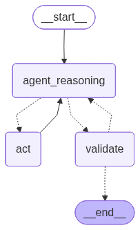

# 🧠 LangGraph Research Agent — OpenAI + Structured Output + Checkpointing


> A small **research agent** built with **LangGraph** and **OpenAI** (`gpt-4o-mini`), demonstrating production-style patterns: structured output with **Pydantic**, a **validation node** with retry logic, **conversation checkpointing**, and tool calling (web search + a custom Python tool).
>
> Originally built as a learning project, extended to demonstrate production patterns relevant to AI-native MVPs.

---

## ✨ Features

- 🔁 **ReAct loop** with conditional routing
- 🧱 **Pydantic structured output** — final answer is a typed `ResearchResult`
- ✅ **Validation node** that re-prompts the LLM if the schema fails
- 💾 **Checkpointing** via `MemorySaver` — conversations resume across invocations
- 🔍 **Tools** — Tavily web search and a custom `triple` Python function
- 📊 **Auto-generated** state-graph diagram

---

## 🧩 Patterns demonstrated

This repo intentionally exercises the LangGraph features most relevant to building real agents:

| Pattern | Where |
| --- | --- |
| `StateGraph` with custom `TypedDict` state | `state.py`, `main.py` |
| Conditional routing on tool-call presence | `should_continue` in `main.py` |
| Tool calling via `bind_tools` + prebuilt `ToolNode` | `react.py`, `nodes.py` |
| Structured output via `with_structured_output(ResearchResult)` | `react.py`, `nodes.py` |
| Validation node with Pydantic + retry counter | `validate_output` in `nodes.py` |
| Checkpointing via `MemorySaver` (resumable threads) | `main.py` |
| Mermaid PNG generation from a compiled graph | `main.py` |

---

## 🏗️ Architecture

Three nodes, two conditional edges:

```
                ┌────────────────────┐
                │ agent_reasoning    │◄────────┐
                │ (OpenAI + tools)   │         │
                └─────────┬──────────┘         │
        tool_calls ?      │       no tool_calls│
                ▼                       ▼      │
        ┌──────────┐             ┌────────────┐│
        │   act    │             │  validate  ││
        │ ToolNode │             │ structured │││
        └─────┬────┘             │  output +  ││
              │                  │  Pydantic  ││
              └─────────────────►└─────┬──────┘│
                                       │       │
                                  valid?│       │
                              yes ─►END │       │
                              no  ─────────────┘
                          (up to MAX_RETRIES)
```

| Node | Responsibility |
| --- | --- |
| `agent_reasoning` | OpenAI (`gpt-4o-mini`) decides whether to call a tool or finish. |
| `act` | Executes tool calls produced by the LLM (`TavilySearch`, `triple`). |
| `validate` | Calls a second LLM instance with `with_structured_output(ResearchResult)`. On Pydantic `ValidationError`, increments `retries` and routes back to `agent_reasoning` (capped at `MAX_RETRIES = 2`). |

State extends LangGraph's `MessagesState` with two extra fields:

```python
class AgentState(TypedDict):
    messages: Annotated[list, add_messages]
    result: Optional[ResearchResult]   # populated by validate
    retries: int                        # bumped on validation failure
```

---

## 📊 Diagram



The diagram is regenerated every time `main.py` runs (via `app.get_graph().draw_mermaid_png(...)`).

---

## 🧱 Structured output schema

```python
class Source(BaseModel):
    url: str
    title: str

class ResearchResult(BaseModel):
    summary: str
    sources: List[Source] = []
    confidence: float           # 0.0 – 1.0
```

The agent's final answer is always a `ResearchResult` instance, ready to serialize, validate, or pipe into a downstream system.

---

## 💾 Checkpointing & resumable threads

The graph is compiled with `MemorySaver`, so every invocation is keyed by a `thread_id` that the caller passes in:

```python
config = {"configurable": {"thread_id": "demo-1"}}

# First turn
app.invoke({"messages": [HumanMessage(content="What's the weather in Tokyo?")], "retries": 0}, config=config)

# Later — same thread, full conversation memory restored from checkpoint
app.invoke({"messages": [HumanMessage(content="And what was that, again?")]}, config=config)
```

`MemorySaver` is in-process; swap for `SqliteSaver` or `PostgresSaver` for durable persistence.

---

## 🚀 Getting started

### Prerequisites

- **Python 3.12+** — [download](https://www.python.org/downloads/)
- **Poetry** — [install guide](https://python-poetry.org/docs/#installation):
  ```bash
  curl -sSL https://install.python-poetry.org | python3 -
  ```

### 1. Clone the repository

```bash
git clone git@github.com:Alvarez527/langgraph-research-agent.git
cd langgraph-research-agent
```

### 2. Install dependencies

```bash
poetry install
```

### 3. Get your API keys

Both services have free tiers:

| Service | Where to get it | Used for |
| --- | --- | --- |
| 🔑 **OpenAI** | <https://platform.openai.com/api-keys> | LLM reasoning (`gpt-4o-mini`) |
| 🔍 **Tavily** | <https://app.tavily.com/home>          | Web search tool |

Optional (for tracing & observability):

| Service | Where to get it | Used for |
| --- | --- | --- |
| 📈 **LangSmith** | <https://smith.langchain.com/settings> | Trace & debug agent runs |

### 4. Configure environment variables

```bash
cp .env.example .env
```

Open `.env` and paste your keys:

```dotenv
OPENAI_API_KEY=sk-...
TAVILY_API_KEY=tvly-...
```

### 5. Run the agent

```bash
poetry run python main.py
```

You will see two turns on the same `thread_id`:

1. **First turn** — the agent calls Tavily, then `triple`, then emits a `ResearchResult` JSON with `summary`, `sources` and `confidence`.
2. **Resumed turn** — same `thread_id`; the agent answers a follow-up using the full prior conversation restored from the checkpoint.

---

## 🔑 Environment variables reference

| Variable | Required | Purpose |
| --- | --- | --- |
| `OPENAI_API_KEY`     | ✅       | LLM reasoning + structured output |
| `TAVILY_API_KEY`     | ✅       | Web search tool |
| `LANGSMITH_TRACING`  | optional | Set to `true` to enable LangSmith tracing |
| `LANGSMITH_API_KEY`  | optional | Required if tracing is enabled |
| `LANGSMITH_PROJECT`  | optional | Project name in LangSmith |

---

## 📁 Project structure

```
langgraph-research-agent/
├── main.py            # graph wiring, checkpointing, demo entry point
├── nodes.py           # reasoning + tool + validate nodes
├── react.py           # LLMs (tool-bound + structured) and tool definitions
├── schemas.py         # Pydantic ResearchResult / Source
├── state.py           # AgentState (TypedDict)
├── pyproject.toml     # Poetry dependencies
├── poetry.lock
├── .env.example
├── .gitignore
└── agent_flow.png     # generated state-graph diagram
```

---

## 📝 License

[MIT](LICENSE)
